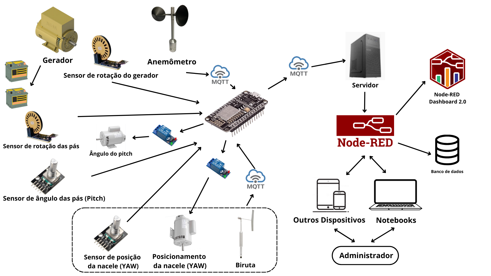

# Sistema de Controle de uma Torre Eolica Experimental com ESP32

## Proposta

O objetivo deste trabalho é desenvolver um sistema de controle e gerenciamento para uma torre eólica experimental, utilizando exclusivamente dados recebidos de sensores. O sistema será responsável por processar informações de direção e velocidade do vento, fornecidas por sensores instalados na torre, e, com base nesses dados, ajustar de forma automatizada a posição da nacele e o ângulo das pás. Além disso, o sistema de controle irá medir a rotação das pás, sincronizando-a com a velocidade do gerador, garantindo que o gerador opere em sua faixa de eficiência máxima. O foco do projeto é a otimização do desempenho da torre eólica através de um controle preciso, utilizando dados em tempo real, sem a necessidade de intervenções manuais ou ajustes de hardware.

## Arquitetura do Projeto:

O projeto segue uma arquitetura onde o ESP32 coleta dados dos sensores e posiciona a nacele e os angulos das pás de acordo com os dados coletados. Além do controle, o ESP32 enviará esses dados coletados via protocolo MQTT para plataforma NODE-RED, que recebe os dados e os exibe em um dashboard, permitindo o monitoramento do sistema.

## Hardware:

### Visão Geral

### Estruturação Modular do Projeto:

### Componentes Utilizados:

- [ESP32 (microcontrolador)](https://github.com/JulioAmaral007/Biodigestor/tree/main/Sensores/ESP32)
- [DHT11 (sensor de temperatura e umidade)](https://github.com/JulioAmaral007/Biodigestor/tree/main/Sensores/Sensor-DHT11)
- [BMP280 (sensor de pressão atmosférica, simulado em ambiente fechado)](https://github.com/JulioAmaral007/Biodigestor/tree/main/Sensores/Sensor-BMP280)
- [MQ-2 (sensor de gás)](https://github.com/JulioAmaral007/Biodigestor/tree/main/Sensores/Sensor-MQ2)

### Objetivos

- Receber dados dos sensores de velocidade e direção do vento.
- Exercer o controle da posição da nacele e o ângulo das pás de acordo com os dados coletados.
- Transmitir dados para um servidor.
